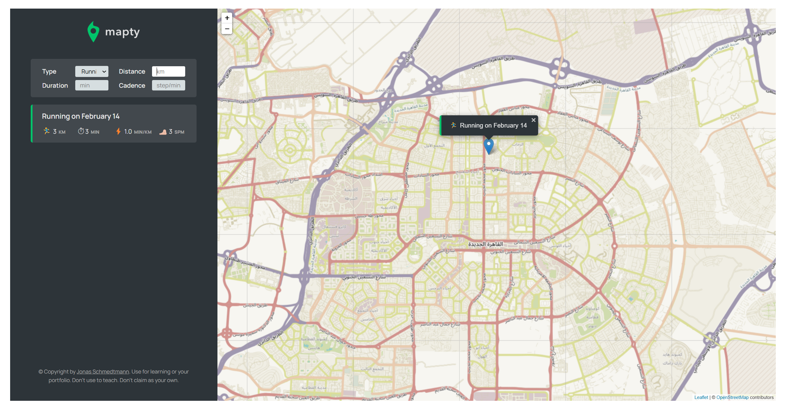

# Mapty - Workout Mapping Application

Mapty is a simple web application that allows users to log their workouts (running and cycling) on a map. Users can input details such as distance, duration, cadence (for running), and elevation gain (for cycling). The application uses geolocation to center the map on the user's current location and stores workout data in the browser's local storage.



## Features

- **Geolocation**: Automatically centers the map on the user's current location.
- **Workout Logging**: Users can log running and cycling workouts with details like distance, duration, cadence, and elevation gain.
- **Interactive Map**: Workouts are displayed as markers on the map, and users can click on them to view details.
- **Local Storage**: Workout data is saved in the browser's local storage, so it persists even after the page is refreshed.

## How to Open the Application

1. **Clone the Repository**: 
   ```bash
   git clone https://github.com/your-repository/mapty.git
   cd mapty
   ```

2. **Open the Application**:
   - Simply open the `index.html` file in your web browser. You can do this by double-clicking the file in your file explorer or by using a command-line tool like:
     ```bash
     open index.html
     ```
     or
     ```bash
     start index.html
     ```
     depending on your operating system.

3. **Using a Local Server**:
   - For a better development experience, you can use a local server to serve the application. If you have Python installed, you can use:
     ```bash
     python -m http.server
     ```
     Then, open your browser and navigate to `http://localhost:8000`.

## File Structure

- **index.html**: The main HTML file that structures the application.
- **style.css**: Contains the styles for the application.
- **script.js**: The main JavaScript file that handles the application logic.
- **icon.png**: The favicon for the application.
- **logo.png**: The logo displayed in the sidebar.
- **Mapty-architecture-final.png**: Architecture diagram of the application.
- **Mapty-architecture-part-1.png**: Part 1 of the architecture diagram.
- **Mapty-flowchart.png**: Flowchart of the application logic.
- **other.js**: Additional JavaScript file (currently commented out in the HTML).
- **.prettierrc**: Configuration file for Prettier code formatting.

## Usage

1. **Logging a Workout**:
   - Click on the map to open the workout form.
   - Select the type of workout (running or cycling).
   - Fill in the details (distance, duration, cadence for running, or elevation gain for cycling).
   - Click "OK" to log the workout.

2. **Viewing Workouts**:
   - Logged workouts will appear as markers on the map.
   - Click on a marker to view the workout details.
   - Workouts are also listed in the sidebar.

3. **Resetting Data**:
   - To clear all workout data, you can call the `reset()` method in the browser's console:
     ```javascript
     app.reset();
     ```

## Dependencies

- **Leaflet.js**: Used for rendering the map and handling map interactions.
- **Google Fonts**: Manrope font is used for styling.

## Credits

- **Jonas Schmedtmann**: The application was developed as part of a tutorial by Jonas Schmedtmann. You can find more about him on [Twitter](https://twitter.com/jonasschmedtman).

## License

This project is for educational purposes. Feel free to use it for learning or in your portfolio, but do not use it to teach or claim it as your own.

---

Enjoy mapping your workouts with Mapty! 🏃‍♂️🚴‍♀️
